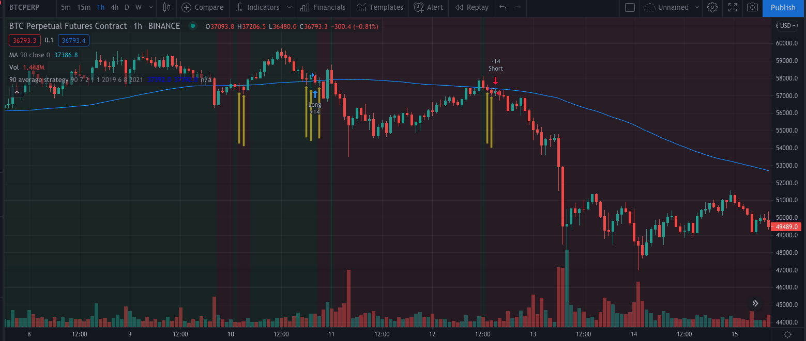

## 破线确认战法
```
//@version=4

strategy("90 average strategy", overlay=true)
//局部变量
anchorMA = input(defval = 90, title = "sma", minval = 1, maxval = 240)
basePosition = input(defval = 7, title = "From Month", minval = 1, maxval = 10000) // 首次建仓开单数量

curCloseAnchorPrice = sma(close, anchorMA) // 当前K线对应的基础局限周期ma close价格
curClosePrice = sma(close, 1) // 当前K线对应的当日close价格 现价
curHighPrice = sma(high, 1) // 当前K线对应的当日high价格 现价
curLowPrice = sma(low, 1) // 当前K线对应的当日low价格 现价

//初始化全局变量
var curPositionState = 0.0 // 1.0为long 2.0为short
var formerCross = 0.0 // 0.0 表示上一个K线没有穿越均线的时刻，1.0表示从下往上穿，2.0表示从上往下穿
var fakeCrossNum = 0.0 // 表示假突破次数
var fakeCrossNumTarget = input(defval = 2, title = "fake cross num target", minval = 1, maxval = 10) // 表示假突破目
var isFakeCrossNum = 0.0 // 表示是否假突破

//定义回测时间
FromMonth = input(defval = 1, title = "From Month", minval = 1, maxval = 12)
FromDay = input(defval = 1, title = "From Day", minval = 1, maxval = 31)
FromYear = input(defval = 2019, title = "From Year", minval = 2019)
ToMonth = input(defval = 6, title = "To Month", minval = 1, maxval = 12)
ToDay = input(defval = 8, title = "To Day", minval = 1, maxval = 31)
ToYear = input(defval = 2021, title = "To Year", minval = 2020)

start = timestamp(FromYear, FromMonth, FromDay, 00, 00) // backtest start window
finish = timestamp(ToYear, ToMonth, ToDay, 23, 59) // backtest finish window
window() => time >= start and time <= finish ? true : false // create function "within window of time"

//当前K均线上下穿，条件
crossOverCondition = crossover(curClosePrice, curCloseAnchorPrice)
crossUnderCondition = crossunder(curClosePrice, curCloseAnchorPrice)

bgcolor(formerCross == 1.0 ? color.green : na)
bgcolor(formerCross == 2.0 ? color.red : na)
plot(curCloseAnchorPrice, "90", 1 ? #0000FF : color.black)
plot(curCloseAnchorPrice, "90", 1 ? #0000FF : color.black)
   
plotarrow(isFakeCrossNum == 1.0 ? 1 : na, "isFakeCrossNum arrow",color.yellow,color.blue,40,-1)

if window()
    isFakeCrossNum := 0.0
    // K线再次破线，重置
    if (crossOverCondition and formerCross == 2.0) or (crossUnderCondition and formerCross == 1.0)
        //重置第一条件，回到默认值，
        formerCross := 0.0
        fakeCrossNum := 0.0
    else
        //记录加突破次数
        // 当上穿, 低点小于90线，收盘大于90线 
        if formerCross == 1.0 and curClosePrice > curCloseAnchorPrice and curLowPrice < curCloseAnchorPrice and curClosePrice > curCloseAnchorPrice
            fakeCrossNum += 1.0
            isFakeCrossNum += 1.0
    
        //记录加突破次数
        //当下穿, 高点大于90线，收盘小于90线 
        if formerCross == 2.0 and  curClosePrice < curCloseAnchorPrice and curHighPrice > curCloseAnchorPrice and curClosePrice < curCloseAnchorPrice
            fakeCrossNum += 1.0    
            isFakeCrossNum += 1.0

    //突破次数达到目标值
    if fakeCrossNum >= fakeCrossNumTarget
        //上穿 && 非做多状态
        if formerCross == 1.0 and curPositionState != 1.0
            //标记做多
            curPositionState := 1.0
            strategy.entry("Long", strategy.long, basePosition)
        
        //下穿 && 非做空状态
        if formerCross == 2.0 and curPositionState != 2.0
            curPositionState := 2.0
            strategy.entry("Short", strategy.short, basePosition)

//上穿
if crossOverCondition
    formerCross := 1.0
//下穿
if crossUnderCondition
    formerCross := 2.0

```

效果图
